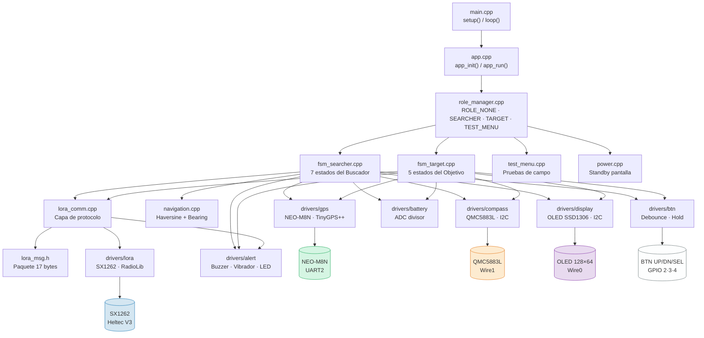
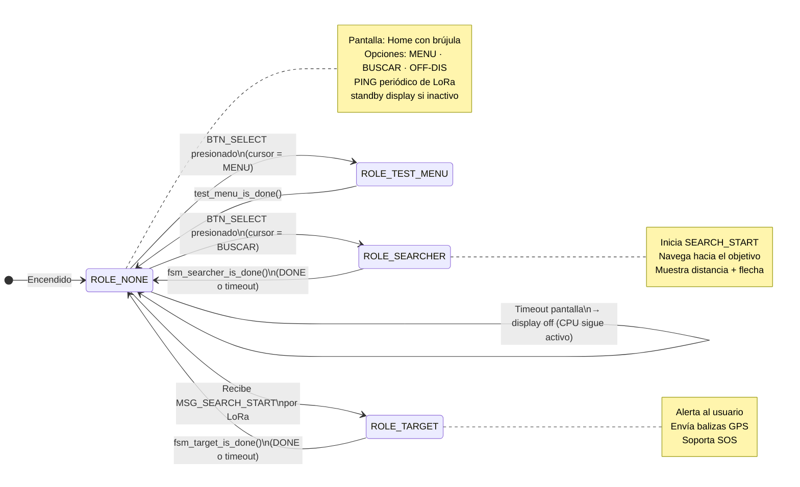
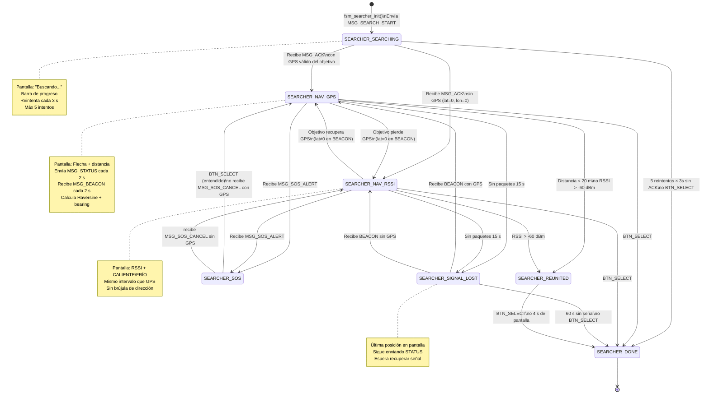
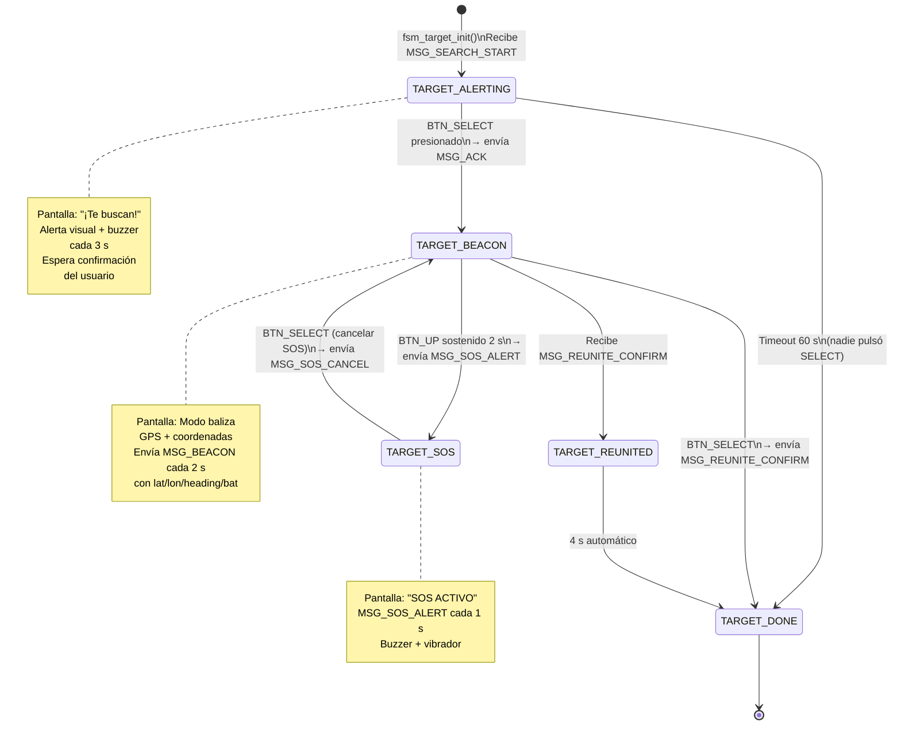
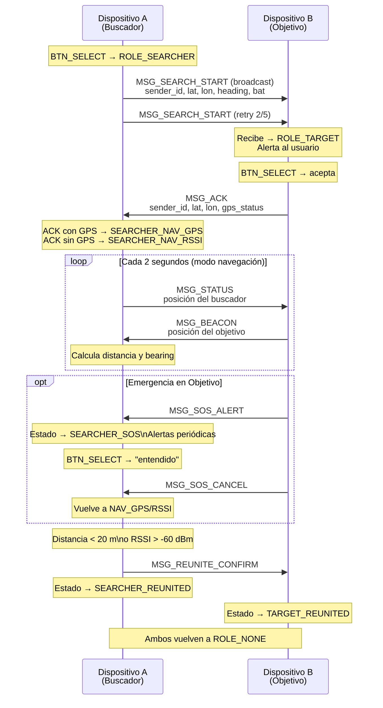

# Diagrama de Estados — LoRa Finder
**Proyecto:** Sistema de búsqueda basado en LoRa
**Autor:** Juan Camilo Moreno Zornosa
**Fecha:** Marzo 2026

---

## 1. Arquitectura de Módulos

Muestra cómo cada archivo del firmware se relaciona con los demás.



---

## 2. Máquina de Estados del Role Manager

El `role_manager` decide qué FSM está activa. Ambos dispositivos corren el **mismo binario** — el rol se asigna dinámicamente.



---

## 3. FSM del Buscador (`fsm_searcher`)

Activo cuando el usuario presiona **BUSCAR** en la pantalla de inicio.



---

## 4. FSM del Objetivo (`fsm_target`)

Se activa **automáticamente** al recibir un `MSG_SEARCH_START` por LoRa.



---

## 5. Flujo de Mensajes LoRa entre Dispositivos

Intercambio de paquetes durante una sesión de búsqueda completa.



---

## 6. Estructura del Paquete LoRa (`lora_msg_t`)

Paquete de **17 bytes fijos**, sin cabecera variable.

```
┌──────────┬───────────────────┬───────────┬───────────┬─────────────┬─────────┬───────────┐
│ Byte 0   │ Bytes 1–4         │ Bytes 5–8 │ Bytes 9–12│ Bytes 13–14 │ Byte 15 │ Byte 16   │
├──────────┼───────────────────┼───────────┼───────────┼─────────────┼─────────┼───────────┤
│ msg_type │ sender_id         │ lat_i     │ lon_i     │ heading_x10 │ bat_pct │ rssi_last │
│ uint8_t  │ uint32_t (MAC)    │ int32_t   │ int32_t   │ int16_t     │ uint8_t │ int8_t    │
│          │                   │ ×10⁶      │ ×10⁶      │ ×10 (0–3599)│ 0–100 % │ dBm       │
└──────────┴───────────────────┴───────────┴───────────┴─────────────┴─────────┴───────────┘
```

| msg_type | Código | Dirección | Descripción |
|----------|--------|-----------|-------------|
| MSG_SEARCH_START | 0x01 | A → broadcast | Inicia búsqueda |
| MSG_ACK | 0x02 | B → A | Objetivo acepta |
| MSG_STATUS | 0x03 | A → B | Posición del buscador |
| MSG_BEACON | 0x04 | B → A | Baliza periódica del objetivo |
| MSG_SOS_ALERT | 0x05 | B → A | Emergencia activa |
| MSG_SOS_CANCEL | 0x06 | B → A | Cancela emergencia |
| MSG_REUNITE_CONFIRM | 0x07 | cualquiera → otro | Confirma reunión |
| MSG_TEST_PING | 0x10 | broadcast | Prueba de campo TX |
| MSG_TEST_PONG | 0x11 | respuesta | Prueba de campo RX |

---

## 7. Configuración LoRa (`system_config.h`)

| Parámetro | Valor | Justificación |
|-----------|-------|---------------|
| Frecuencia | 915 MHz | Banda ISM Región 2 — Colombia |
| Bandwidth | 125 kHz | Balance sensibilidad / velocidad |
| Spreading Factor | SF7 | ToA ~41 ms, alcance urbano 200–300 m |
| TX Power | **22 dBm** | Máximo del SX1262 |
| Coding Rate | 4/5 | Redundancia mínima |
| Reintento SEARCH_START | 3 s × 5 | 15 s timeout total |
| Intervalo STATUS/BEACON | 2 s | Actualización de posición |
| Señal perdida | 15 s sin paquete | → estado SIGNAL_LOST |
| Abandono | 60 s en SIGNAL_LOST | → DONE |
| Umbral reunión GPS | < 20 m | Haversine entre ambos nodos |
| Umbral reunión RSSI | > −60 dBm | Sin GPS disponible |
